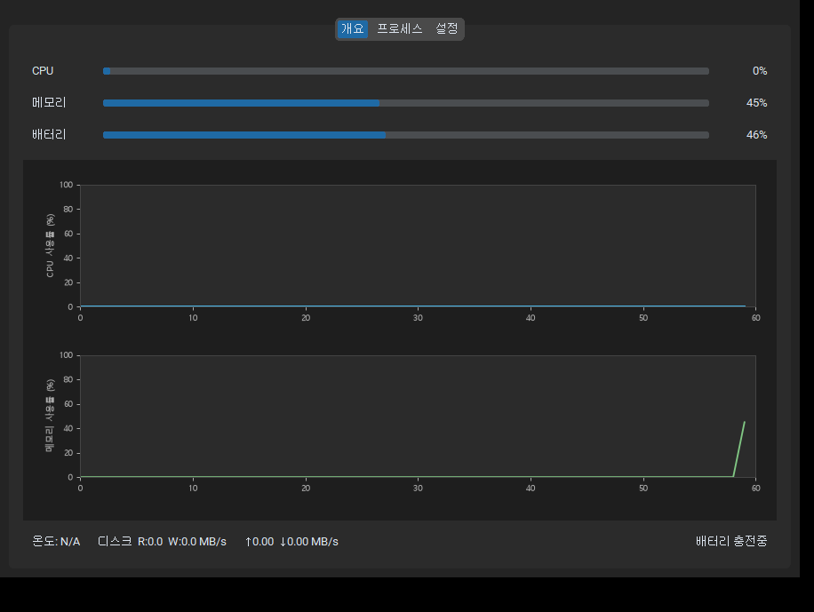
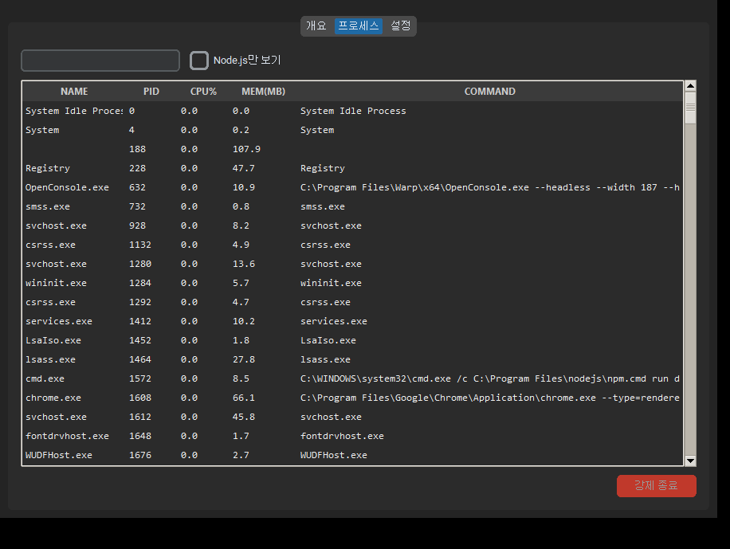

# SysMonitor

Windows용 시스템 성능 모니터링 도구. CPU / 메모리 / 배터리 / 디스크 / 네트워크를 실시간으로 확인하고, 전체 프로세스 목록에서 불필요한 프로세스(특히 Node.js)를 강제 종료할 수 있습니다.




## 기능

- **실시간 모니터링** — CPU / 메모리 / 배터리 진행바 + 60포인트 라인 그래프
- **시스템 수치** — 온도, 디스크 R/W, 네트워크 업/다운 속도
- **프로세스 관리** — 전체 프로세스 목록, 이름 검색, Node.js 필터, 강제 종료
- **설정** — 갱신 주기(1·2·5·10·30·60초), 다크/라이트 테마, 시작 탭 선택
- **이식성** — `.exe` 단일 파일 or 소스 실행 모두 지원

## 실행 방법

### 소스로 실행

```bash
git clone https://github.com/gnghkim/sysmonitor.git
cd sysmonitor
pip install -r requirements.txt
python main.py
```

### .exe 빌드 (PyInstaller)

```bash
pip install pyinstaller
pyinstaller build.spec
# dist/SysMonitor.exe 생성 (~41MB)
```

## 요구 사항

- Python 3.11+
- Windows 10 / 11

| 라이브러리 | 역할 |
|-----------|------|
| customtkinter | 다크/라이트 UI |
| psutil | CPU / 메모리 / 프로세스 수집 |
| wmi + pywin32 | 온도 센서 (Windows) |
| matplotlib | 실시간 그래프 |

## 단축키

| 키 | 동작 |
|----|------|
| `Delete` | 선택한 프로세스 강제 종료 |

## 프로젝트 구조

```
sysmonitor/
├── main.py
├── requirements.txt
├── build.spec
└── app/
    ├── ui/
    │   ├── main_window.py   # 메인 윈도우, 탭 컨테이너
    │   ├── tab_overview.py  # 개요 탭 (그래프 + 수치)
    │   ├── tab_processes.py # 프로세스 탭 (테이블 + 종료)
    │   └── tab_settings.py  # 설정 탭
    ├── core/
    │   ├── collector.py     # 백그라운드 데이터 수집 스레드
    │   └── killer.py        # 프로세스 강제 종료
    └── models/
        └── system_stats.py  # 데이터 모델
```
